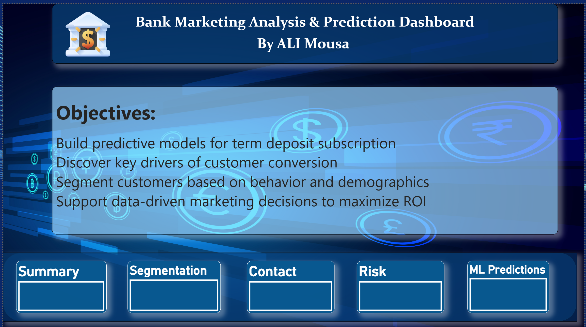
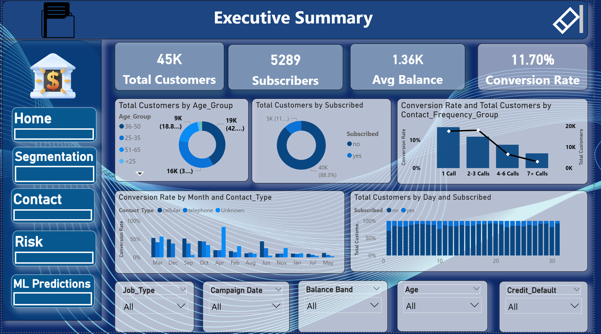
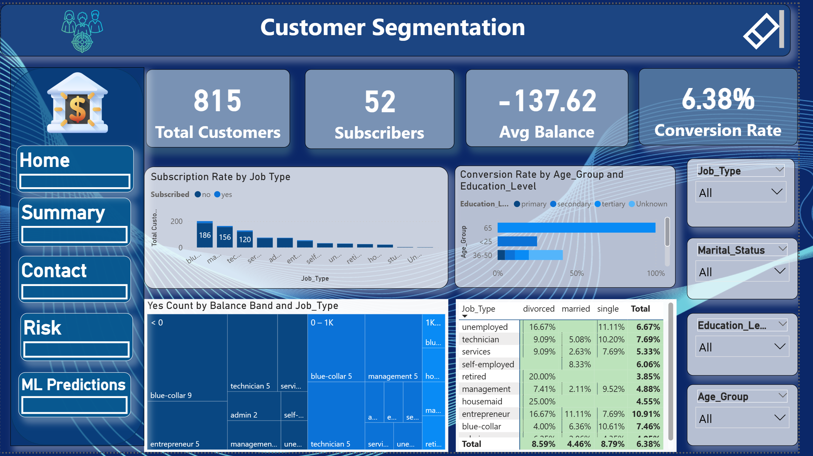
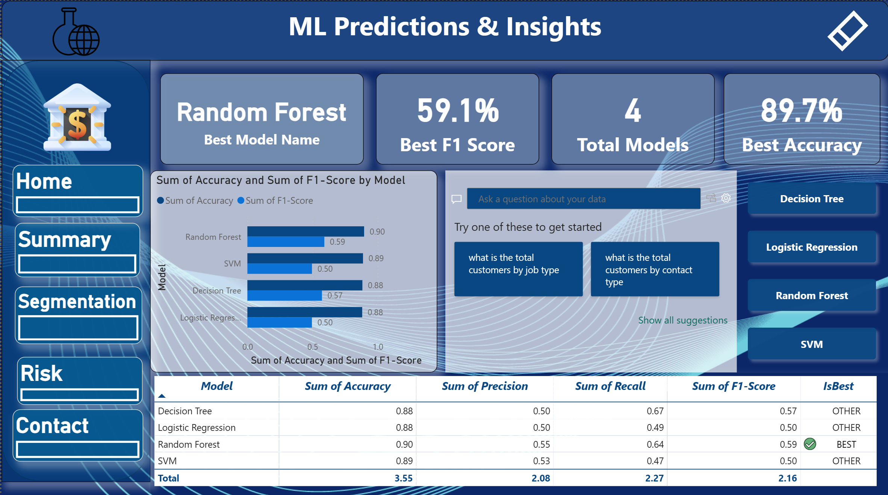
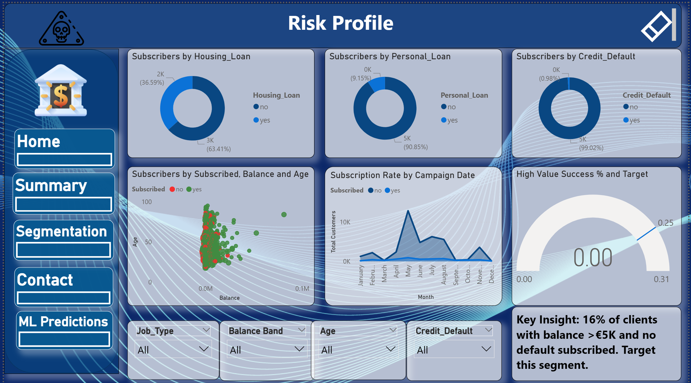
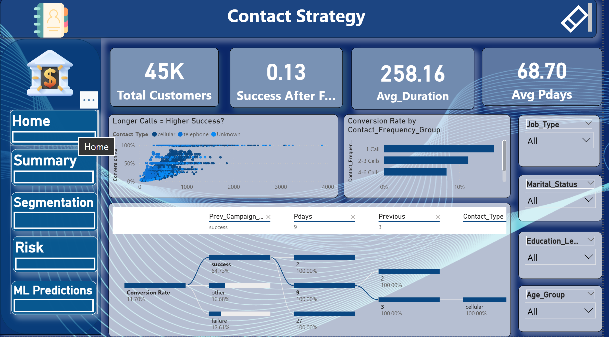

# 📊 Bank Marketing Analytics & Machine Learning Project

## 🚀 Project Overview
This project analyzes bank marketing campaign data to understand customer behavior and predict whether a client will subscribe to a term deposit.

The main goal is to improve marketing efficiency by targeting the right customers using data analysis and machine learning.

---

## 🎯 Business Problem
Banks run large marketing campaigns, but the conversion rate is low (~6%).  
This results in high cost and low efficiency in customer targeting.

---

## 💡 Solution Approach
- Performed data cleaning and exploratory data analysis (EDA)
- Built customer segmentation to understand different user groups
- Developed machine learning models for prediction
- Created an interactive dashboard for business insights

---

## 🛠️ Tools & Technologies
- Python (Pandas, NumPy, Scikit-learn)
- Machine Learning
- Power BI
- Excel

---

## 📊 Dashboard Preview

### 🏠 Home Overview

### 📈 Summary Insights

### 👥 Customer Segmentation

### 🤖 Machine Learning & Prediction

### ⚠️ Risk Analysis

### 📞 Contact Section

---

## 🔍 Key Insights
- Identified key factors affecting customer subscription
- Discovered distinct customer segments
- Improved targeting strategy using ML predictions
- Reduced marketing waste by focusing on high-potential clients

---

## 📁 Project Structure